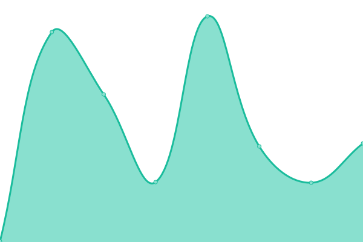
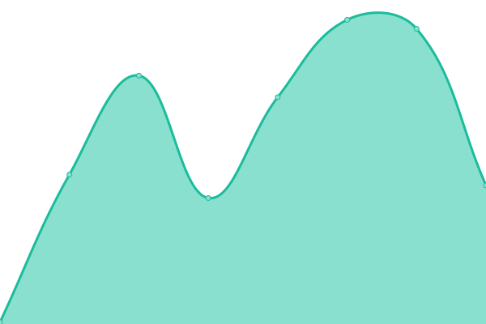
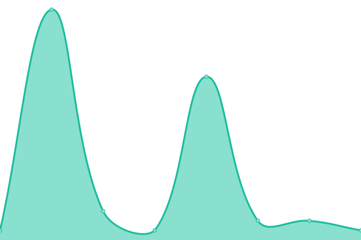
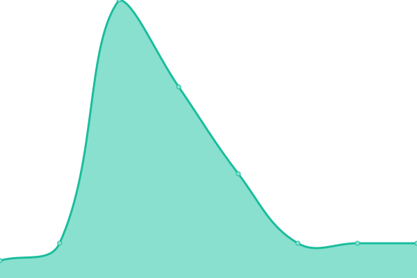

# [📈 Live Status](https://esxbrasilrp.github.io/upptime): <!--live status--> **🟧 Partial outage**

This repository contains the open-source uptime monitor and status page for [ESXBrasil Role Player](https://esxbrasilrp.github.io/upptime), powered by [Upptime](https://github.com/upptime/upptime).

With [Upptime](https://upptime.js.org), you can get your own unlimited and free uptime monitor and status page, powered entirely by a GitHub repository. We use [Issues](https://github.com/esxbrasilrp/upptime/issues) as incident reports, [Actions](https://github.com/esxbrasilrp/upptime/actions) as uptime monitors, and [Pages](https://esxbrasilrp.github.io/upptime) for the status page.

<!--start: status pages-->
<!-- This summary is generated by Upptime (https://github.com/upptime/upptime) -->
<!-- Do not edit this manually, your changes will be overwritten -->
<!-- prettier-ignore -->
| URL | Status | History | Response Time | Uptime |
| --- | ------ | ------- | ------------- | ------ |
|  [FiveM](https://fivem.net) | Up | [five-m.yml](https://github.com/esxbrasilrp/upptime/commits/HEAD/history/five-m.yml) | 

 97ms
     
 | 

<a href="https://esxbrasilrp.github.io/upptime/history/five-m">100.00%</a>
    

|  [ESXBrasilRP](https://esxbrasilrp.github.io) | Up | [esx-brasil-rp.yml](https://github.com/esxbrasilrp/upptime/commits/HEAD/history/esx-brasil-rp.yml) | 

 89ms
     
 | 

<a href="https://esxbrasilrp.github.io/upptime/history/esx-brasil-rp">100.00%</a>
    

|  [RenildoMarcio](https://renildomarcio.com.br) | Up | [renildo-marcio.yml](https://github.com/esxbrasilrp/upptime/commits/HEAD/history/renildo-marcio.yml) | 

 348ms
     
 | 

<a href="https://esxbrasilrp.github.io/upptime/history/renildo-marcio">100.00%</a>
    

|  [Forum FiveM](https://forum.cfx.re) | Up | [forum-five-m.yml](https://github.com/esxbrasilrp/upptime/commits/HEAD/history/forum-five-m.yml) | 

 500ms
     
 | 

<a href="https://esxbrasilrp.github.io/upptime/history/forum-five-m">100.00%</a>
    

|  [Servers FiveM](https://servers.fivem.net) | Down | [servers-five-m.yml](https://github.com/esxbrasilrp/upptime/commits/HEAD/history/servers-five-m.yml) | 

 90ms
     
 | 

<a href="https://esxbrasilrp.github.io/upptime/history/servers-five-m">100.00%</a>
    

|  [Docs FiveM](https://docs.fivem.net) | Up | [docs-five-m.yml](https://github.com/esxbrasilrp/upptime/commits/HEAD/history/docs-five-m.yml) | 

 467ms
     
 | 

<a href="https://esxbrasilrp.github.io/upptime/history/docs-five-m">100.00%</a>
    

|  [Google DNS 1](8.8.4.4) | Up | [google-dns-1.yml](https://github.com/esxbrasilrp/upptime/commits/HEAD/history/google-dns-1.yml) | 

 8ms
     
 | 

<a href="https://esxbrasilrp.github.io/upptime/history/google-dns-1">100.00%</a>
    

|  [Google DNS 2](8.8.8.8) | Up | [google-dns-2.yml](https://github.com/esxbrasilrp/upptime/commits/HEAD/history/google-dns-2.yml) | 

 7ms
     
 | 

<a href="https://esxbrasilrp.github.io/upptime/history/google-dns-2">100.00%</a>
    

<!--end: status pages-->

[**Visit our status website →**](https://esxbrasilrp.github.io/upptime)

## 📄 License

- Powered by: [Upptime](https://github.com/upptime/upptime)
- Code: [MIT](./LICENSE) © [ESXBrasil Role Player](https://esxbrasilrp.github.io/upptime)
- Data in the `./history` directory: [Open Database License](https://opendatacommons.org/licenses/odbl/1-0/)
